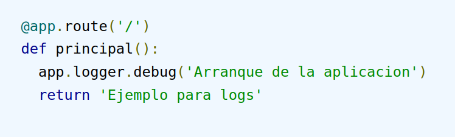
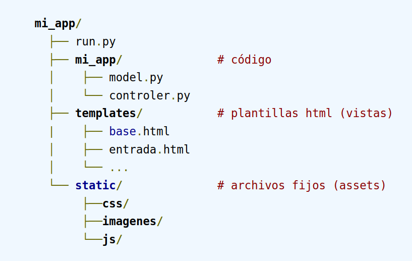
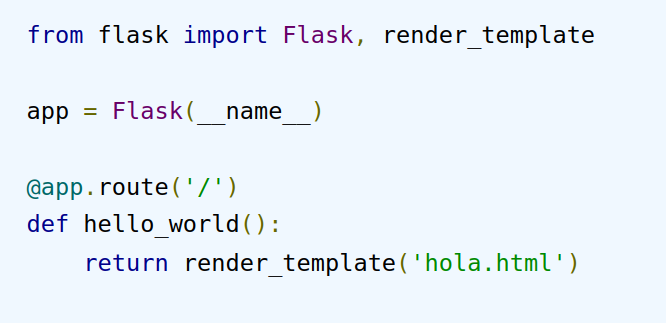
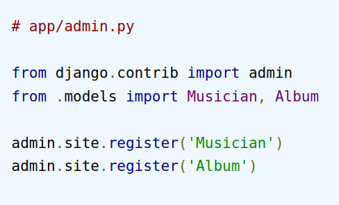
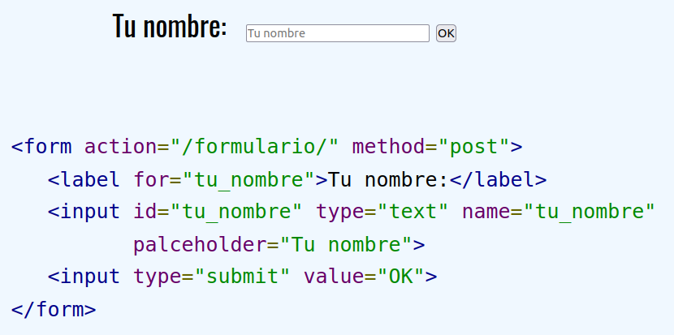
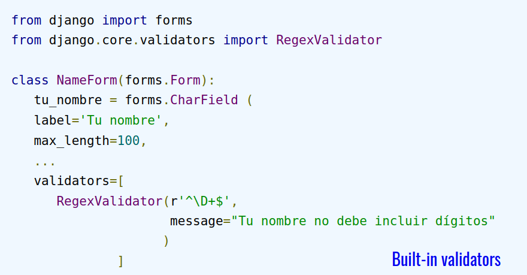

# Teoría de DAI 2021-2022

> Por: Mapachana

## Tema 1: Codificación de caracteres: Unicode

### Codificaciones para signos

En Europa occidental usamos 4 codificaciones distintas para los signos del alfabeto latino:

- **ASCII**
- **ISO-8859-1, ISO-8859-15**, "Latin1" (ANSI en windows)
- **UTF-8**
- **UTF-16** (**UNICODE** en windows)

### ASCII

American Standard Code for Information Interchange

Es un código de 7 bits creado en 1963, solo para los **signos** que se usan **en inglés**.

El fin de línea se pone como `\n` en unix, `\r\n` en windows y `\r` en mac.

### Códigos ISO-8859

Son 16 códigos distintos de 8 bits, **ampliaciones del ASCII**, que permiten usar signos alfabéticos usados en otras lenguas distintas del inglés.

En **Europa occidental** usamos el conjunto de caracteres Latin-1 en alguna de sus variantes:

- **ISO-8859-1**
- **ISO-8859-15** (revisión del anterior para añadir el signo del euro €)
- **Windows-1252 (ANSI)**

### Unicode

Es una **codificación universal** con un repertorio de más de 120 000 signos de cualquier alfabeto, cada uno tiene asignado un **code point**.

Los intérpretes de unicode manejan automáticamente la dirección de la escritura y la composición de signos.

Unicode se puede codificar de 3 maneras:

- **UTF-8** (en unix, internet, ...)
- **UTF-16** (en windows)
- **UTF-32**

#### UTF-8

Es una **codificación variable de 8 bits** compatible con ASCII.

- **1 byte**: **US-ASCII** (128 caracteres).
- **2 bytes**: **Caracteres romances más signos diacríticos**, alfabetos griego, cirílico, armenio, hebreo, árabe... (1920 caracteres).
- **3 bytes**: **Caracteres del plano básico multilingüe** de unicode: caracteres de uso común, incluyendo chino, japonés y coreano.
- **4 bytes**: **Caracteres el plano suplementario multilingüe**. Símbolos matemáticos y alfabetos clásicos para uso académico.

#### Uso

**UTF-8** es el más generalizado, sobre todo en internet y en UNIX.

**UTF-16** se usa en windows.

En html o xml se puede escribir cualquier signo: `&#decimal;` o algunos signos se pueden escribir con character encodings.

En internet **se presupone UTF-8** a menos que se indique otra cosa


Se puede cambiar con cualquier editor de texto, o con las utilidades de UNIX `iconv` y `recode`.

#### Soporte en c++

En unicode no todos los caracteres tienen 1 Byte. Para estos está el tipo `wchar_t` en lugar de `char` y las funciones `wcs`.

#### Unicode en Python

En **Python2** existe el tipo `unicode` distinto del `str`.

Desde **Python3** el tipo `str` contiene caracteres unicode.

En Python3 existen los tipos `str` (unicode) y `binary`. Para convertir desde o hasta las distintas codificaciones están las funciones `byte.decode()` y `str.encode()`.


Se trabaja en unicode internamente, y solamente se debe **convertir** a o desde una codificación concreta en la **entrada/salida**.

`write` y `open` codifican y decodifican automáticamente (UTF-8 por defecto).


<div style="page-break-after: always;"></div>

## Tema 2: Cliente-Servidor, Protocolo HTTP

### Cliente-Servidor

Las aplicaciones web están distribuidas en dos partes que se ejecutan en máquinas distintas:

- **Cliente**:
  - Proactivo, inicia la comunicación.
  - Hace requerimientos a un servidor.
  - Se encarga de la interfaz de usuario.
- **Servidor**:
  - Reactivo, está esperando requerimientos para responderlos.
  - Responde a varios clientes.
  - Se encarga de la lógica del programa y de la comunicación con la base de datos.

La comunicación entre el cliente y el servidor puede ser:

- **Síncrona:** El cliente hace la petición y espera hasta que el servidor le contesta.
- **Asíncrona:** El cliente hace la petición, sigue trabajando y en algún momento recibirá la respuesta del servidor.

#### Acciones del cliente y servidor

- **Acciones del cliente**:
  - Interfaz de usuario
  - Traducir la petición al protocolo correspondiente
  - Enviar petición al servidor
  - Esperar respuesta
  - Traducir la respuesta del servidor a un formato legible
  - Presentar los resultados al usuario
- **Acciones del servidor**:
  - Esperar la petición de un cliente
  - Procesar la petición
  - Devolver los resultados al cliente

#### Ventajas

- El cliente se **ejecuta en un navegador** o como aplicación nativa más raramente.
- Por tanto es **independiente de la plataforma**, vale para cualquier SO, incluyendo móviles.
- Se **adaptan fácilmente a los cambios** en los dispositivos de acceso a la red.
- Es **fácil hacer actualizaciones**.
- Se puede **usar desde cualquier sitio** remotamente.
- Se pueden poner como **Software as a service** (con subscripciones).

### HTTP (HyperText Transfer Protocol)

Para comunicar clientes y servidores se usa **HTTP**, un **protocolo sin estado**, es decir, sin memoria. Esto quiere decir que no necesita que el servidor guarde información o estados sobre cada usuario durante las múltiples solicitudes.

Es un **protocolo cliente-servidor** para comunicar aplicaciones. Es un **protocolo ASCII con peticiones** (requests) **y respuestas** (responses).

#### Motivos para que sea un protocolo sin estado

1. Para que el **servidor no guarde información sensible** como contraseñas o tarjetas de crédito
2. Para que el **servidor no almacene información innecesaria** en caso de que el cliente se caiga
3. En caso de **caída del servidor**, mejor que el cliente asuma que el servidor no tiene información suya que confiar en que la guarda.
4. Si el cliente interactúa con varios servidores sería necesaria comunicación y **almacenamiento sincronizado** de los servidores.

#### Request


Los métodos de las requests están asociados a las operaciones del **CRUD**. Los métodos son:

-  **GET:** Solicita una representación de un recurso específico. Se usa para recuperar datos **(Leer)**. Los parámetros de consulta van en la URL.

  

- **POST:** Para enviar una entidad a un recurso específico, causando cambios en el servidor **(Crear)**. Las variables del formulario van como contenido en el requerimiento después de las cabeceras.
- **PUT:** Reemplaza todas las prestaciones actuales del recurso de destino con la carga útil de la petición **(Actualizar)**.
- **DELETE:** Borra un recurso específico **(Borrar)**.

En todos los métodos distintos de GET los parámetros van detrás de las cabeceras:


#### Response


### Cookies y Sesiones

Como se dijo antes, HTTP es un protocolo sin estados, pero hay veces que algunas webs necesitan rastrear el progreso del usuario de una página a otra, por lo que se necesita almacenar algún tipo de información para el usuario. Como solución a este problema surge el uso de **cookies**, **sesiones en el servidor**, variables ocultas (cuando hay formularios en la página), reescritura de URL con parámetros codificados, etc.

#### Cookies

Se almacenan **en el navegador** como un formato de **archivo de texto.** Se almacena una cantidad límite de datos (solo permite 4KB). La variable `$_COOKIE` no contendrá variables cookies con el mismo nombre.

Podemos acceder fácilmente a los valores de las cookies, por lo que es **menos seguro.** La función `setcookie()` debe aparecer antes de la etiqueta `<html>`.

#### Sesiones

Se almacenan **en el lado del servidor**. Se almacena una cantidad limitada de datos. En una sesión se mantiene información de la conexión, asociando cookies con un token aleatorio, con un registro en el servidor, por lo tanto no podemos acceder fácilmente y es **más seguro**.

<div style="page-break-after: always;"></div>

## Tema 3: Micro Frameworks Web: Flask

### Web Applications Frameworks

Es **software para apoyar en el desarrollo** de aplicaciones web.

Los Web Frameworks son software framework diseñados para apoyar el desarrollo de aplicaciones web, incluyendo servicios web y APIs.

Vamos a estudiar **Flask** (micro framework) y **Django**.

### Flask

**Flask** es un **micro framework**. Sus características son:

- Servidor de desarrollo y depurador incorporado.
- Soporte integrado para pruebas unitarias.
- Plantillas Jinja2.
- Soporte para cookies seguras (sesiones en el lado del cliente).
- Compatible con unicode.
- Profusamente documentado.

#### Hola mundo


#### Manejo de URLs


Se pueden usar variables en las URLs:


#### Entrada de variables GET (parámetros)


#### Cabeceras HTTP


#### Métodos HTTP


#### Redirecciones y errores


#### Cookies

Leer cookie:


Escribir cookie:


#### Sesiones

Se manda un cookie de sesión con un token aleatorio, y se asocia con un registro persistente en el servidor.

```Python
from flask import Flask, session, redirect, url_for, escape, request

app = Flask(__name__)

# Set the secret key to some random bytes. Keep this really secret!
app.secret_key = b'_5#y2L"F4Q8z\n\xec]/'

@app.route('/login', methods=['GET', 'POST'])
def login():
    if request.method == 'POST':
        session['username'] = request.form['username']
        return redirect(url_for('index'))
    return '''
        <form method="post">
            <p><input type=text name=username>
           <p><input type=submit value=Login>
        </form>
  '''

  @app.route('/')
  def index():
  if 'username' in session:
    return f'Logged in as {escape(session['username']}
  return 'You are not logged in'

...

@app.route('/logout')
def logout():
    # remove the username from the session if it's there
    session.pop('username', None)
    return redirect(url_for('index'))
```

#### Logs

Registro de eventos usando el módulo `logging` de Python.



<div style="page-break-after: always;"></div>

## Tema 4: MVC

### Modelo Vista Controlador

Separar en archivos y carpetas distintas (módulos, packages) el código relativo a;

- Base de datos: **Model**.
- Interfaz de usuario: **View**.
- Comunicaciones, lógica: **Controller**.


### Modelo

- Interacción con la **Base de Datos** (SELECT, INSERT, UPDATE, DELETE).
- **Lógica relacionada con los datos** (cuanta más mejor), por ejemplo restricciones de los datos, campos derivados, etc.
- **Comunica con el controlador**.

### Vista

- Donde **interacciona el usuario**
- Usualmente **HTML, CSS y JavaScript**.
- **Comunica con el controlador**.
- A través de **plantillas** (templates).

### Controlador

- **Recibe la entrada de las vistas o URLs** (routing).
- **Procesa las requests** (GET, POST, PUT, DELETE).
- **Interacciona con el modelo**.
- **Rellena y envía las plantillas**.

### Estructura de carpetas



### ORM

El **Mapeo de Objeto-Relacional** es un modelo de programación que consiste en la t**ransformación de las tablas de una base de datos en una serie de entidades que simplifique las tareas básicas** de acceso a los datos para el programador.

- Django ORM: Muy completo y permite evitar que escribir SQL a mano, añadiendo la posibilidad de cambiar de base de datos sin que sea traumático.


### Ficheros de ejemplo en Python

#### model.py

Con ORM:


#### controller.py


#### view.html

Con plantillas y html.


<div style="page-break-after: always;"></div>

## Tema 5: Plantillas (Templates)

### Flask: Plantillas (Templates)

**Flask** usa **Jinja** como **motor de plantillas**:

- HTML escaping.
- Filtros.
- Herencia de plantillas.
- Compilado a python nativo eficiente.
- Sintaxis configurable (para acomodarse mejor a otros formatos de salida como LaTeX o JavaScript).

#### Hola mundo

##### hola.py



##### hola.html


#### Paso de variables


#### Filtros

Efectúan modificaciones en el html


#### Bucles


#### Acceso a diccionarios


#### Sintaxis moustache

- `` Sentencias.
- `{{ ... }}` Expresiones que serán impresas en la salida de la plantilla.
- `{# ... #}` Comentarios (no aparecerán en la salida).
- `# ... ` Sentencias de una línea.

#### Herencia de plantillas

Permite crear una base, que luego será personalizada en otras plantillas.

##### base.html

```html
<!DOCTYPE html>
<html lang="en">
<head>
    <link rel="stylesheet" href="style.css" />
    <title> Mi sitio  web </title>
</head>
<body>
    <div id="content">
	    
	    
	 </div>
    <div id="footer">
        
        © Copyright 2008 by <a href="http://domain.invalid/">LALALA</a>.
        
    </div>
</body>
</html>
```

##### hijo.html

```html


 Otra página 


    <h1>Título de la página</h1>
    <p class="important">
      ¡Bienvenido piltrafilla!
    </p>

```

#### HTML seguro

Por defecto **Jinja2** "escapea" el HTML que le enviamos. Se puede desactivar:

- Usando la clase Markup en el código de python (recomendado).
- Usar el filtro `lsafe` dentro de la plantilla (`{{ variable | lsafe }}`)
- Desactivar el sistema de "escaping" temporalmente (``)

<div style="page-break-after: always;"></div>

## Tema 6: HTML5, css frameworks

### Versiones

- HTML 2.0, (1995)    en los primeros navegadores
- HTML 3.2, (1997)     ya incluyó formularios y tablas
- HTML 4.0, (1997)     con CSS
- HTML 4.01, (1999)     el que venimos usando
- XHTML 1.0, (2000)  
  . . .     plugins: flash player, java, javascript, silverlight, actionscript
- HTML5, (2014)     versión actual

### Novedades del HTML5

- **Nuevo parsing**, no basado en `SGML`, se dispara con `<!DOCTYPE html>`.
- **Elementos multimedia:**  `<audio>`, `<video>` y `<canvas>`.
- **Elementos semánticos** para sustituir a `<div>` y `<span>`: `<section>`, `<article>`, `<header>`, `<footer>`, `<nav>`.
- N**uevos elementos para forms:** `<datalist>`, tipos de entrada para campos: `<text>`, `<date>`, `<url>`, `<tel>`, `<number>`, `<color>`, etc con validación del navegador.
- **Inclusión de `SVG` y `MATHML`.**
- **Soporte de geolocalización**.
- **Soporte para arrastrar y soltar**.
- Soporte de **almacenamiento local**: Web storage.
- **Soporte para CSS3. CSS3** tuvo muchas novedades, como:
  - **Flexbox.**
  - **Grid.**

HTML5 todavía no está completamente implementado. No todos los navegadores soportan todas las propuestas.

### CSS Frameworks

A la hora del diseño de una página web ayudarían plantillas para:

- **Elementos complejos** que podamos poner, como menús, enlaces, forms.
- **Situar los elementos** en la página, que queden legibles e iguales en todos los navegadores.
- Que **cambie adecuadamente con el tamaño** del dispositivo: móvil, tablet o PC.

### Twitter Bootstrap

Es una colección de plantillas de css y js originalmente usada en twitter.

- **Responsive design** (adaptación automática a móviles y tablets).
- **Grid system** (posicionar los elementos en la página).
- **Interface UI** (forms, botones, menús, etc).

Además se pueden encontrar recursos aparte de la distribución oficial.

#### Usando bootstrap

1. Descargamos el código desde Bootstrap o usamos un Content Delivery Network.
2. Nos bajamos alguna de las plantillas de los ejemplos.
3. Nos fijamos en el sistema de grid para controlar como aparecerán los elementos en distintos tamaños de pantalla.
4. Vamos añadiendo componente tal y como viene en la documentación.

### Alternativa: MaterializeCSS

Es un framework CSS que permite crear sitios y apps webs con los principios de **Material Design** (creado por Google). Puede ser usado en dos formas, Materialize y Sass, dependiendo de las preferencias y la experiencia se pueden seleccionar cualquiera de las dos versiones. Incluye:

- **Grids:** 3 tamaños de plantilla.
- **Blockquotes**: Posicionar los elementos en la página.
- **Flow text** (responsive text), **botones, checkboxes, barras de navegación**, estilos para tablas y cards.

<div style="page-break-after: always;"></div>

## Tema 7: XML a fondo

### XML (eXtensible Markup Language)

Es un **metalenguaje de propósito general para intercambio y almacenamiento de información**.

Es un subconjunto simplificado de SGML (es un estándar para definir lenguajes de marcado generalizado. Se llama Standarf Generalized Markup Language), diseñado para que sea **legible** también por personas.

Tiene un uso muy amplio, sobre todo en internet.

#### Niveles de XML

Hay dos niveles de restricción en los archivos XML:

- **Válidos:** Cumplen con la sintaxis del XML.
- **Bien formados:** Que además tengan una especificación propia para sus elementos (que se puedan validar con un DTD o un XML Schema).

### XML bien formado

En un archivo XML bien formado nos podemos encontrar:

- Prólogo.
- Elementos
- Atributos.
- Referencias a caracteres.
- Entidades predefinidas.
- Comentarios.
- Secciones CDATA (character data).
- Instrucciones de procesamiento.

#### Prólogo

Un documento XML comienza por una **etiqueta inicial** y quizás con una **declaración de un DTD o esquema**.


UTF-8 es la codificación por defecto, si se usa otra hay que ponerla.

#### Elementos

Delimitados por **etiquetas de principio y fin,** excepto si son vacíos, en cuyo caso solo contienen contienen la **etiqueta con autocierre** `<.../>`.

Los elementos **se estructuran en un árbol**. Siempre hay un elemento raíz que incluye a todos los demás.


#### Atributos

Los **atributos** van **en la etiqueta de apertura**. Es obligatorio que tengan su **valor entre comillas** (simples o dobles).


#### Referencias a entidades carácter

En XML se puede poner cualquier signo en la codificación que se use, normalmente UTF-8, o con su código numérico unicode, o con referencias a entidades predefinidas.


#### Caracteres reservados

En XML están reservados los caracteres:

- &: `&amp;`.
- <: `&lt;`.
- \>:`&gt;`.
- ": `&quot;`.
- ': `&apos;`.

#### Comentarios, secciones CDATA

Los **comentarios** se indican : `<!-- Comentario -->`.

Las **secciones CDATA** sirven para incluir **texto que el parser no va a procesar:**

```xml
<![CDATA[
 ...
]]>
```

#### Instrucciones de procesamiento

Se utilizan para poner **indicaciones para las aplicaciones que procesen el archivo** XML.

La sintaxis es `<?target instruction ?>`.

Por ejemplo se pueden aplicar hojas de estilo a documentos XML.


### Reglas para XMLs bien formados

- Siempre tiene que haber **un solo elemento raíz**.

- Los elemento no vacíos tienen **etiqueta de inicio y fin**.

- Elementos **vacíos con** marca de **autocierre**.

- **Los elementos no se pueden cruzar**:

  

- **El valor de los atributos se delimita con comillas.**

### DTDs y XML Schemmas

Un **DTD** (Document Type Definition) o un **XML Schemma** son **declaraciones de la sintaxis** para un lenguaje XML partiuclar, con las definiciones de los elementos y atribubtos.

Para que un documento XML sea válido, tiene que tener una referencia a un DTD o Schemma.

### Espacios de nombres

A veces puede haber interferencia cuando se usa en un mismo documento distintos lenguajes XML. Para distinguir los delementos de cada uno se usan los **espacios de nombres**.

### Procesado de archivos XML

Hay 3 maneras (como mínimo) de procesar archivos XML (o HTML):

- **Usando expresiones regulares**.
- Con parsers **`SAX`**.
- Con parsers **`DOM`**.

Las librerías para SAX y DOM son estándar y existen con las mismas funciones para c, c++, PHP, Java, Perl, etc.

#### Expresiones regulares

```python
import re

# 'portada.xml' es un rss en
# http://ep00.epimg.net/rss/elpais/portada.xml

file = open('portada.xml', encoding='utf-8')
contenido = file.read()
file.close()

parser = re.compile('<.+?>|[^<>]*', re.S)

for e in parser.findall(contenido):
	print("[%s]" % e.replace ('\n', '\\n'))

	if e.find('</') >= 0:
		print("etiqueta final")

	elif e.find('<') >= 0:
		print("etiqueta inicial")
	else:
		print("texto")
```

#### Biblioteca de eventos SAX

**Simple Api para XML** es una librería **basada en eventos**: se va leyendo el archivo y se generan llamadas a funciones conforme se leen las etiquetas.

```python
# etree sax parser
from lxml import etree

class ParseRssNews():           # manejadores de eventos

	def __init__(self):
		print('--------------------- Principio del archivo')

	def start(self, tag, attrib):          # Etiquetas de inicio
		print('<%s>' % tag)
		for k in attrib:
			print('%s = "%s"' % (k,attrib[k]))

	def end(self, tag):                    # Etiquetas de fin
		print('</%s>' % tag)

	def data(self, data):                  # texto
		print('-%s-' % data)

	def close(self):
		print('---------------------- Fin del archivo')


parser = etree.XMLParser(target=ParseRssNews())
url = 'http://ep00.epimg.net/rss/elpais/portada.xml'
etree.parse(url, parser)
```

#### Manejo dinámico del árbol: DOM

**Document Object Model** es una **API** para manejar la **estructura de árbol** de un documento XML: Se lee todo el archivo en memoria y se accede a cada nodo del árbol para leerlo, modificarlo, ampliarlo, etc.


Ejemplo de DOM Parser:

```python
import xml.dom.minidom

# parse file into a dom
file = open('portada.xml', encoding='utf-8')
dom = xml.dom.minidom.parse(file)
file.close()

lista_items = dom.getElementsByTagName('item')

for item in lista_items:
    item.setAttribute('modificado', 'hoy')
    otro_elemento = dom.createElement('otro')
    texto = dom.createTextNode('Un texto que ponemos en el elemento')
    otro_elemento.appendChild(texto)
    item.appendChild(otro_elemento)

print(dom.toxml())
```

#### lxml etree parser

El módulo **lxml** tiene un API más sencillo y adaptado a python que el DOM usual: el **etree**.

```python
from lxml import etree
file = open ('portada.xml', encoding='utf-8')
tree = etree.parse(file)
file.close()

rss = tree.getroot() # elemento raiz

# Los elementos funcionan como listas
channel = rss[0]     # Primer hijo

for e in  channel:
	if (e.tag == 'item'):  # Atributo tag, nobre del elemento
		# Añado 
		e.set('modificado', 'hoy')

		# Los atributos del xml funcionan casi como diccionarios
		print (e.keys(), e.get('modificado'))

		# Creo otro elemento
		otro = etree.Element('otro')   # 

		# Atributo text
		otro.text = 'Texto de otro'
		e.insert(0, otro) # Añado Texto de otro (posicion inicial)

print(etree.tounicode(rss, pretty_print=True))


```

Un ejemplo de cómo recorrer un archivo con lxml etree iterparser (en lugar de SAX):

```python
# etree iterparse

from lxml import etree

context = etree.iterparse ('http://ep00.epimg.net/rss/elpais/portada.xml',
                            events=('start','end'))

for action, element in context:
	text = ""

	if (element.text != None):
		text = element.text.encode('utf-8')

	print ('%s - %s - %s' % (action, element.tag, text))
```

#### XPATH

**XPATH** es un minilenguaje para **especificar partes de un** **árbol DOM**:

```python
from lxml import etree

tree = etree.parse('http://ep00.epimg.net/rss/elpais/portada.xml')

items = tree.xpath('/rss/channel/item')

for i in items:
	categorys = i.xpath('category')
	for c in categorys:
		print(c.text)      # Textos en category

for url in tree.xpath('//@url'):
	print(url)                 # Todos los atributos url

for t in tree.xpath('//text()'):
	print(t)                   # Todos los texto
```

### Soporte para html

**lxml** también tiene soporte para archivos html.

```python
from lxml import etree

parser = etree.HTMLParser()
tree = etree.parse('http://www.aemet.es/es/portada', parser)

# Todos los enlaces
urls=tree.xpath('//@href')

for u in urls:
	print(u)
```

<div style="page-break-after: always;"></div>

## Tema 8: Persistencia: Bases de Datos

### CRUD

- **Create**.
- **Read**.
- **Update**.
- **Delete.**

### Operaciones para la persistencia de datos

- Sistema de archivos.
- Persistencia de datos básica.
- Archivos indexados.
- Bases de datos relacionales (SQL).
- Bases de datos NoSQL.
- Motores de búsqueda.

#### Serialización de datos

Con el módulo **`pickle`** guardamos un objeto en disco.


#### Archivos indexados tipo `dbm`

Con **`dbm`** se accede a bases de datos tipo `Berkely DB` como si estuvieran en memoria.


#### Persistencia de objetos `shelve`

**`shelve`** añade una capa de software a `dbm` para **serializar los objetos**.


#### Persistencia de objetos `pickleshare`

Las aplicaciones web se ejecutan en paralelo en varias hebras, **`pickleshare` añade concurrencia a `shelve`**.


### Librerías Object Relational Mapping

Una capa de software para aislar la BD SQL del resto de código.

### Bases de datos

A diferencia de los archivos indexados, las **bases de datos**:

- Están en un **proceso servidor separado** (excepto SQLite).
- Permiten **búsquedas por varios índices**.
- Tienen un **manejo estandarizado**.

#### Usar bases de datos con una librería cliente


#### Usar bases de datos con dos tipos de librerías


### Bases de datos NoSQL

Se hicieron para tratar con **Big Data** (Volumen, Velocidad y Variedad). Tienen **tipos de datos complejos, más índices, distintas maneras de consulta**, etc.


### Base de datos MongoDB

Es una **base de datos orientada a documentos estilo JSON** (BSON) que incluye información del tipo de dato.

En mongoBD una base de datos está formada por **colecciones** (equivalentes a tablas en SQL), que son un conjunto de **documentos** (equivalentes a filas). Estos documentos son similares a objetos diccionario de python. Cada uno de ellos incluye un campo `_id` similar a una llave primaria en SQL.

#### Librería pymongo


#### Mongoengine

Un Object Document Mapper (ODM) para mongoDB. Nos permite mapear la estrucura de nuestra base de datos a objetos en nuestras aplicaciones Python que se conectan a instancias como MongoDB. El propósito es poder usar información de nuestra base de datos como si se tratasen de objetos.

Ofrece numerosas ventajas, como la manera CRUD de escribir en nuestra aplicación y mejorar nuestro código.

### Otras BD

- Redis.
- Elasticsearch.
- Hadoop.
- Firebase.

<div style="page-break-after: always;"></div>

## Tema 9: API RESTfull

### Servicios Web

Son un conjunto de **protocolos y estándares para comunicar aplicaciones e intercambiar datos en internet**.

Se usa **HTTP** y el puerto **80** para evitar problemas con los firewall.

La interface (API) puede ser tipo:

- **REST**: Más simple.
- **SOAP**: WDSL: de nivel más alto, cada vez menos usados.

### SOAP (Simple Object Access Protocol)

Es un protocolo estandarizado para el intercambio de mensajes estructurados.

- Se usaba para transacciones complejas que requieran alta seguridad, como pasarelas de pago, ERPs, etc.
- Solo intercambia XML.
- Puede usar varios protocolos: HTTP, FTP, SMTP, etc.
- Puede ser con estado, e intercambio confiable de información.

### REST (REpresentational State Transfer)

Muy generalizado para acceso a servicios (google maps, telegram, twitter, cualquier back-end para móvil, etc).

Este término se usa ahora para referirse a **interfaces simples, que solo usan HTTP y JSON o XML en la respuesta**.

Se basan en una sintaxis universal para acceder a los recuersos de internet: las **URIs** (Uniform Resource Identifier). En las URIs se usa código tanto por ciento.

**REST es un protocolo sin estado.**

La llamada (usualmente GET) que se hace desde un navegador, app de móvil o desde un servidor y la respuesta es XML, JSON o HTML.

#### RESTfull

En su versión más extendida se usan los verbos de HTTP para las llamadas del cliente al servidor, asociandolos a operaciones CRUD.

Un servicio RESTfull debe seguir **4 principios**:

- **Usar los verbos HTTP explícitamente**.
- **Ser completamente sin estado**, para que el resultado de la llamada no dependa de las anteriores (Sea idempotente y cacheable).
- **Usar URIs estilo path** (clean URIs), que se puedan leer por humanos y que muestren una jerarquía, sustituyendo espacios en blanco por guiones o subrayados..
- **Devolver XML o JSON.**

Los paths de la api se denominan **endpoint** y exponen al exterior un recurso de la BD.

La respuesta es JSON, con el status line correspondiente.


#### Varios métodos de acceso

- Las llamadas con AJAX


- Desde un servidor se puede usar la librería request


- Desde consola con curl o httpie:


<div style="page-break-after: always;"></div>

## Tema 10: Frameworks Web: Django

### Framework Django

Es el framework para Python más usado.

- Empezó a desarrollarse como herramienta para **sitios de prensa**.
- Está enfocado a **sitios basados en bases de datos** (por ejemplo ebay).
- **Software libre**.
- Primera versión en 2008.

### Arquitectura MVT

- **Model:** Interface con la BD (mediante ORM).
- **View:** El programa (Equivalente a Controller en MVC).
- **Template:** Vista.

### Módulos

Django incluye muchos módulos, entre los que se encuentran:

- Object Relational Mapper (ORM).
- Interface de administración de la bD.
- Autenticación.
- Autorización.
- Sesiones.
- Templates.
- Formularios.
- Muchos otros.

### Flask vs Django


#### Hola mundo


### Middleware

El **middleware** intercepta el request para añadir información y conforma el response.

### Pasos para crear una aplicación

1. Crear un proyecto.
2. Crear una aplicación dentro del proyecto.
3. Poner la base de datos (SQL) y demás en `settings.py`.
4. Añadur los módulos y middleware en `settings.py`.
5. Crear un superusuario.
6. Definir el modelo en `app/models.py`.
7. Crear la base de datos (migración).
8. Crear los mappings para las urls en `urls.py`
9. Definir las vistas e `app/views.py` y los templates.
10. Aplicar tests.
11. Desplegar la aplicación en el servidor web de producción.

<div style="page-break-after: always;"></div>

## Tema 11: Modelos en Django

### Model

Django utiliza un **ORM** para bases de datos SQL.

Usa **clases en lugar de tablas**.


Una **clase model** tiene:

- **Declaración de campos.**
- **Métodos**.
- **Metadatos**.

Por defecto Django asigna una clave primaria automática a no ser que se asigne un campo como `primary_key` o como `unique`.


#### Fields


#### Relaciones muchos a uno


#### Relaciones muchos a muchos


#### Relaciones uno a uno


#### Opciones meta


#### Métodos


Se pueden sobrecargar los métodos por defecto:


#### Admin

Para que aparezcan en la app de admin de la BD:



#### Create


#### Queries


#### Usando BD No-SQL

Con **mongoengine** que está muy inspirado en el ORM de Django:


<div style="page-break-after: always;"></div>

## Tema 12: Formularios

### Formularios

Django incluye una **clase `Forms`** para facilitar la entrada de datos desde formularios html.

La clase incluye:

- **Generación del html en las plantillas**.
- **Validación en el servidor**.
- **Tratamiento de los errores.**
- **Seguridad CSRF.**

#### Ejemplo de código




La vista al recoger el request: Si es válido se procesa, si no se devuelve el formulario con los errores.

Están previstas validaciones automáticas en el servidor.



Incluso derivando forms de models.


### Personalizando los forms

Se pueden usar widgets, info para el html. Por ejemplo, Django Crispy Forms.

### Serializadores

Desde APIs se usan **serializadores** para:

- Transformar desde los objetos de la BD a JSON (o XML).
- Desde JSON a la BD, comprobando validadores y devolviendo error en su caso.

Se puede hacer con el plugin Django REST Framework.

<div style="page-break-after: always;"></div>

## Tema 13: Autentificación y Autorización en Django

### Autentificación de usuarios

Django tiene un sistema para la **autentificación** basado en un **modelo para usuarios** que incluye:

- **Autentificación**: gestión de contraseñas.
- **Roles:** grupos de usuarios.
- **Autorización**: permisos sobre las vistas y el modelo.
- **Forms y view tools.**

#### Autentificación en el request

Django utiliza sesiones y **middleware** para gestionar automáticamente la autenticación de usuarios, con funciones para comprobar el usuario y contraseña en la base de datos de usuarios.

E incluso tiene un decorador para ponerlo en las vistas que requieran usuarios autentificados.

#### Autentificación y registro

Django ya proporciona plantillas, formularios y vistas para la autentificación y creación de usuarios (Authentication views), incluyendo el cambio de contraseña, la confirmación, gestión de contraseña, etc.

Pero es más cómodo utilizar el plugin `django-allauth` que además tiene prevista la autenticación delegada en redes sociales. (Bueno esa es tu opinión).

<div style="page-break-after: always;"></div>

## Tema 14: Internacionalización del software I18N

### L10N y I18N

#### L10N

**Localization:** Adaptar el software a otro país con otro:

- Alfabeto
- idioma de la interfaz.
- Formato de fechas.
- Moneda.
- Formato de las cantidades.

#### I18N

**Internacionalization:** Preparar los programas para poder localizarlos fácilmente y para que cambien de entorno dinámicamente según la elección del usuario.

### Localizar

En general **localizar consiste en traducir:**

- **La interface:** Menús, cuadros de diálogo, etc. Están en archivos .resx (windows) o .po (linux).
- La ayuda (archivos de hipertexto).
- **Resto de la documentación, sitios web**, etc.
- **Adaptación a la cultura de la interface** (colores, términos inapropiados, etc.).

Esto es tarea de traductores.

### Internacionalizar: Gettext

Tecnología para internacionalizar software:

- **Gettext**: En UNIX desde 1995.
- **MUI**: En Windows desde Windows2000.

Se trata de separar la parte dependiente de la lengua en archivos separados.

#### Ventajas

- El **ejecutable es único** para todas las lenguas.
- Las **traducciones están en archivos independientes,** hechas por especialistas.
- Se puede **cambiar de idioma en tiempo de ejecución**, dependiendo de la instalación del SO o navegador.

### Gettext

Es la **librería tradicional de UNIX para I18**N, la que se usa e linux para los programas de escritorio, y en PHP, Python (Django, Flask, etc) para apliaciones web.

Para aplicaciones Java o en Android la internacionalización se hace de una manera parecida, cambian los formatos de los archivos involucrados.

#### Archivos .mo y locale

Los textos para cada lengua, van en archivos **`.mo` (machine object)**, compilados a partir de los textos en archivos **`.po` (portable object),** que están en un directorio aparte para cada locale (lengua). Por defecto en `/usr/share/locale`.

Para cada entorno se utiliza un `locale` distinto, cada uno con su nombre:

`lengua[_pais][.codificacion][@modificacion]`.

Por ejemplo, es (español), es_AR (español para Argentina), es_AR.UTF-8 o es_ES@euro (español para España cn modificación euro).

Se usa `locale` para ver el locale actual y `locale -a` para ver todos los instalados.

#### Definición de Locale

Cambio del comportamiento de alguna de las funciones de la librería estándar del C, según el valor de las variables de entorno asignadas a cada categoría.

Algunas categorías del locale:

- **LC_TYPE**: Relacioanda con la condificación (islower()).
- **LC_COLLATE**: Relacionada con el ordenamiento.
- **LC_MESSAGES**: Relacionada con la salida (print) (gettext()).
- **LC_MONETARY**: Relacionada con signo de moneda.
- **LC_NUMERIC**: Relacionada con formatos de números.
- **LC_TIME**: Relacionada con formatos de fechas.

#### Variables de entorno

Para decidir el locale en tiempo de ejecución se consultan las variables de entorno:

- **LC_ALL**.
- **LC_CTYPE**.
- **LANG**.

Para aplicaciones web se consulta la cabecera de http **HTTP_ACCEPT_LANGUAGE** en el request, que manda el navegador.

### Cambiar los mensajes

Para cambiar los mensajes en lugar de `printf "Hola mundo\n";` se hace `printf gettext("Hola mundo\n");`. O redefiniendo la función gettext `printf _("Hola mundo\n")`.

`gettext` busca el texto correspondiente al locale actual en tiempo de ejecución, en un archivo distinto, por defecto `/usr/share/locale/en_US/LC_MESSAGES/mi_programa.mo`.

### Archivos

#### Archivos .po

Los **archivos `.mo`** (machine object, compilados) para cada lengua se generan **a partir de archivos de texto `.po`** (portable object).

Por ejemplo, para la traducción al inglés se haría un archivo `mi_programa.po` para el directorio (y el locale) en_US, que contendría:


Se puede usar el programa `xgeettext` para sacar automáticamente una plantilña con todos los mensajes bajo gettext.

#### Archivos .mo

Una vez traducidos **los archivos .po se compilan con `msgfmt` a archivos .mo** y se ponen en los directorios correspondientes `/usr/share/locale/en_US/LC_MESSAGES/mi_programa.mo`.

### Proceso

1. Poner gettext() donde se vaya a traducir el código fuente.
2. Crear la plantilla .pot pasando la utilidad xgettext al código fuente.
3. traducir rellenando una plantilla para cada lengua, poniéndolas en un archivo .po.
4. Compilar las traducciones con `msgfmt` a un archivo .mo.
5. Poner las traducciones en sus locales correspondientes al instalar el programa.


### Plurales

A veces los mensajes varían con el número **(singular o plural)**. Para estos casos se utiliza la función `ngettext`. El primer argumento es el singular, y se usa como índice en la búsqueda, y el segundo es el plural, y el tercero es el número.


Y en el archivo .po:


### Traducción asistida

Con estos programas se hace una **traducción semi-automática** (asistida), con:

- Memorias de traducción (traducciones anteriores).
- Conexión a APIS de traducción automática (google).
- Glosarios especializados.
- Avisos de errores de ortografía, puntuación, etc.

### En Django


<div style="page-break-after: always;"></div>

## Tema 15: Javscript, ES6 y jQuery

### Javascript

**En el navegador** tenemos que usar Javascript, aunque hay otras alternativas como typescript, coffeescript, dart y otros.

Javascript es **asíncrono**.

### ES6

**ES6** significa **ECMAScript6**. ECMAScript se creó para **estandarizar javascript**. ES6 se publicó en 2015 (su versión anterior, ES5 es de 2009, y ES1 de 1997). 

NodeJS es una versión de Javascript ES6 para el servidor.

### JQuery

**JQuery** es una librería de javascript.

<div style="page-break-after: always;"></div>

## Tema 16: DOM, JQuery

### DOM

Javascript maneja el DOM.


**DOM (Document Object Model)** es una **interfaz multiplataforma independiente del lenguaje** que trata un documento **HTML o XML como una estructura de árbol**, en la que cada nodo es un objeto representando una parte del documento.

###  JQuery

**JQuery** es considerado un framework de javascript, es decir, es un conjunto de utilidades que podemos usar.

Es una librería de javascript para:

- **Seleccionar y manipular HTML y CSS.**
- **Modificar el DOM.**
- **Animaciones.**
- **AJAX**.

Permite agregar efectos y funcionalidades complejas a nuestro sitio web, como galerías de fotos dinámicas, validación de formularios, calendarios, aparecer y desaparecer elementos de nuestra página, etc.

#### Ejemplos


### AJAX

**AJAX es asíncrono**. Se usa en aplicaciones que siendo ejecutadas en el cliente se comunican con el servidor de manera asíncrona para obtener datos y no recargar la página.

Ejemplos de AJAX con JQuery:


Código en flask:


Código en django:


#### Ejemplo de prácticas:

```javascript
function modificar(){
  pokemon = {
    "id": parseInt($("#id").val()),
    "name": $("#name").val(),
    "img": $("#img").val(),
    "type": $("#type").val(),
    "height": parseFloat($("#height").val()),
    "weight": parseFloat($("#weight").val()),
    "candy": $("#candy").val(),
    "egg": $("#egg").val(),
  }

  $.ajax({
    type: "PUT",
    url: "/pokemon/"+pokemon["id"],
    dataType: "json",
    data: JSON.stringify(pokemon),
    success: function(msg){
      alert(msg['estado'])
    }
  })

}
```

<div style="page-break-after: always;"></div>

## Tema 17: Despliegue

### Despliegue

Para poner en **producción** una aplicación web, necesitaremos hacer algunos cambios:

- **Deshabilitar el ambiente de depuración**.
- **Cambiar el servidor de web por el definitivo de producción.**


### WSGI

Hay que conectar la aplicación con un servidor web de producción en lugar del runserver.

**Django**, como el resto de los frameworks de python, necesitan un **servidor web con interface Web Server gateway Interface (WSGI**).

**WSGI** tiene previsto que haya **middleware entre el servidor web y la aplicación**, a ambos lados del API.

#### gunicorn

**gunicorn** es un servidor web **WSGI** muy sencillo de instalar, que sustituye al runserver de desarrollo.

Django ya tiene el archivo .wsgi en el mismo directorio de settings.py.

#### Supervisión

Para arrancar y mantener arrancado el servidor gunicorn podemos usar **supervisord**, que vigilará que el proceso siempre esté ejecutándose (en el caso de no usar contenedores).

También se puede usar **systemd**.

### nginx

Además, necesitamos un segundo servidor web para **servir los archivos estáticos**, balance de carga, cifrado, etc.

Para esto se usa **nginx**.

Django dejará de servir los archivos en `/stactic` y `/media` cuando esté en `DEBUG=False`, por tanto haremos un script para copiar los archivos al directorio donde los sirva nginx.

### Servicios en la nube

#### Software as a Service (SaaS)

Se te da acceso a una aplicación software en la nube a la que se refieren como "on-demand software". No te preocupas de la instalación, configuración ni ejecución. El proveedor lo hace por ti. Solo pagas y la usas a través de un cliente. Por ejemplo las aplicaciones de google.

#### Platform as a Service (PaaS)

Se te provee de una plataforma que incluye SO, entorno de ejecución de algún lenguaje de programación, base de datos, servidor web, etc. Por ejemplo Heroku.

#### Infraestructure as a Service (IaaS)

Se te provee de una infraestructura física o virtual (máquinas virutales) y otros recursos como librerías de discos de máquinas virtuales, firewalls, almacenamiento, direcciones IP, etc. Por ejemplo Google Compute Engine, Windows Azure.


### Virtualización ligera

Una posibilidad es usar un **contenedor** para instalar la aplicación.

#### docker

De esta manera se **independiza la instalación del servidor de producción,** el ejecutable va a ser siempre el mismo.

Además la instalación va a simplificarse al utilizarse scripts de aprovisionamiento.

- **Dockerfile**: En un solo contenedor

```yaml
from python:3.7
maintainer yo@correo.es

# PRODUCCION
run pip install gunicorn

# servidor web y watchdog 
run apt-get install -y supervisor nginx

#  configuraciones
run cp  despliegue/supervisor.conf /etc/supervisor/conf.d/
run cp  despliegue/nginx-default /etc/nginx/sites-available/default

run sed -i 's/DEBUG = True/DEBUG= False/' Pruebas_django/settings.py

expose 80

cmd despliegue/collect_static.sh && supervisord
```

Docker también se puede usar para desarrollo con **docker-compose.**

```yaml
version: '3.7'
services:
    nginx:
      image: nginx:alpine
      ports:
        - 80:80
        - 443:443
      volumes:
        - ./conf:/etc/nginx/conf.d:ro  # dir para archivo configuración 
        - ./web/static: /var/www/static
      depends_on:
        - web

    web:
      build: web
      # ports:         # no es necesario
      #  -8000: 8000   
      restart: always
      # command: supervisord
      command: gunicorn proyecto.wsgi:application --bind 0.0.0.0:8000
      # command: python manage.py runserver 0.0.0.0:8000
      volumes:
        - ./web: /web
  
```

